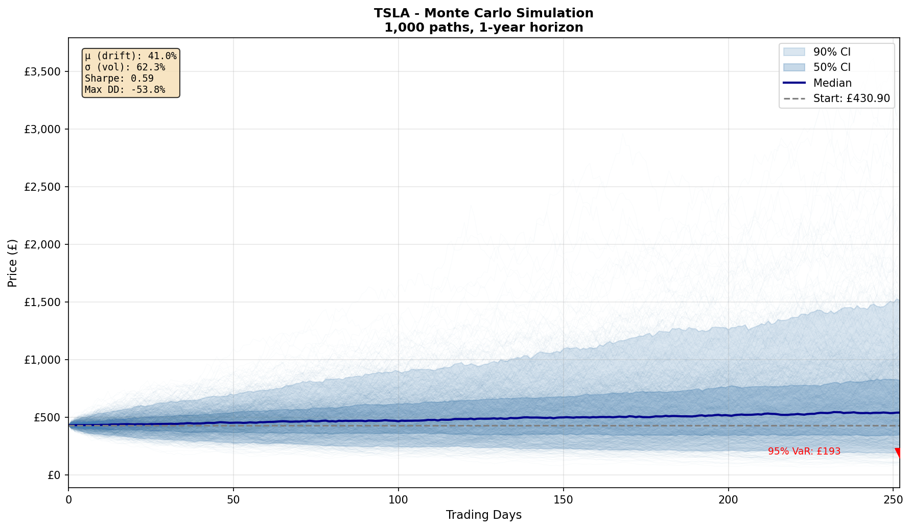

# Monte Carlo Risk Engine 📈

A financial risk analysis tool I built to learn about quantitative finance and apply some of the maths from my engineering degree to stock market simulation.

## Why I Built This

I'm studying Automotive Engineering but got interested in quant finance after watching some YouTube videos about how hedge funds work. Turns out a lot of the maths overlaps - stochastic processes, differential equations, probability distributions. So I thought I'd try building something practical.

The goal was to answer: **"If I buy this stock today, how much could I lose over the next year?"**

## What It Does

1. Downloads historical stock data from Yahoo Finance
2. Calculates statistics (average return, volatility)
3. Simulates 1,000 possible future price paths using Monte Carlo
4. Calculates risk metrics like VaR (Value at Risk) and Sharpe Ratio
5. Creates visualisations

## The Maths (Simplified)

I use **Geometric Brownian Motion** to simulate stock prices. The basic idea:

```
Tomorrow's price = Today's price × exp(drift + randomness)
```

Or more formally:
```
S(t+dt) = S(t) × exp((μ - σ²/2)dt + σ√dt × Z)
```

Where:
- `μ` = average return (the trend)
- `σ` = volatility (how much it bounces around)
- `Z` = random number from normal distribution

The `(μ - σ²/2)` term is called "Ito's correction" - it's a mathematical adjustment I had to look up. Basically accounts for the difference between arithmetic and geometric means when dealing with continuous random processes.

### Why 1,000 simulations?

More simulations = better estimate of the probability distribution. I tried 100 (too noisy), 10,000 (took ages), and settled on 1,000 as a good balance.

## Risk Metrics Explained

**Value at Risk (VaR)**: The maximum expected loss at a given confidence level. If 95% VaR = -£50, you're 95% confident you won't lose more than £50.

**Sharpe Ratio**: Return per unit of risk. `(Return - Risk-free rate) / Volatility`. Higher is better. Below 1 is meh, above 2 is good.

**Maximum Drawdown**: Biggest peak-to-trough drop historically. Important because a -50% loss needs a +100% gain to recover!

## How to Run

```bash
# Install dependencies
pip install -r requirements.txt

# Run it
python monte_carlo_risk_engine.py
```

You can change the stocks being analysed at the bottom of the script:
```python
STOCKS = ['TSLA', 'F', 'SPY']  # Add/remove tickers here
```

## Sample Output

```
TSLA Risk Analysis
================================
Current Price:         £430.90
Annual Return:         41.02%
Annual Volatility:     62.33%
Sharpe Ratio:          0.594
Max Drawdown:          -53.77%
--------------------------------
95% VaR (1-Year):      £-238.27
99% VaR (1-Year):      £-318.77
```

This means: with 95% confidence, you won't lose more than £238 on a single TSLA share over the next year. But there's a 5% chance you could lose more!

## Example Charts

The script generates fan charts showing all 1,000 simulated paths:



The blue shaded regions show confidence intervals - 50% of paths fall within the dark band, 90% within the light band.

## Limitations & Future Work

Things I know aren't quite right:

1. **Constant volatility assumption** - Real markets have volatility clustering (big moves follow big moves). Could add GARCH model.

2. **No correlation modelling** - Currently treats each stock independently. In reality, they're correlated, especially during crashes.

3. **Historical parameters** - Uses past data to predict the future. As they say, past performance doesn't guarantee future results.

4. **No transaction costs** - Real trading has fees, spreads, slippage.

Things I want to add:
- [ ] Portfolio optimisation (Markowitz style)
- [ ] Correlation matrix between assets
- [ ] Interactive GUI with Streamlit
- [ ] Compare my VaR with actual historical losses

## What I Learned

- How to structure a Python project properly (classes, separation of concerns)
- The maths behind option pricing and risk management
- Why quants use log returns instead of simple returns
- matplotlib is powerful but fiddly
- Yahoo Finance API is unreliable sometimes

## Resources That Helped

- Hull, J.C. - "Options, Futures and Derivatives" (Chapter 14)
- QuantPy YouTube channel
- Wikipedia page on Geometric Brownian Motion
- Stack Overflow (obviously)

## Requirements

```
numpy>=1.24.0
pandas>=2.0.0
yfinance>=0.2.28
matplotlib>=3.7.0
```

---

Built by Kyle W | MEng Automotive Engineering | January 2026
